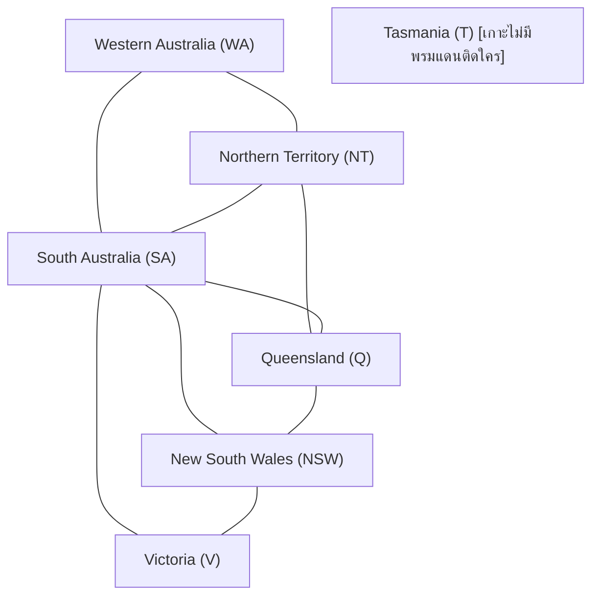

# การระบายสีแผนที่ด้วย Constraint Satisfaction Problem (CSP) - Map Coloring

โปรเจกต์นี้แก้ปัญหา **การระบายสีแผนที่ (Map Coloring)** ด้วยแนวคิด **Constraint Satisfaction Problem (CSP)** ตามสไลด์การเรียนรู้ โดยใช้แผนที่ประเทศออสเตรเลียเป็นโจทย์ตัวอย่าง

---

## 1. โจทย์ปัญหาการระบายสีแผนที่ (Problem Formulation)

เป้าหมายคือการหาชุดของสีเพื่อระบายให้กับทุกรัฐในประเทศออสเตรเลีย โดยมีเงื่อนไขสำคัญคือ:
> **"รัฐหรือภูมิภาคที่มีพรมแดนติดกัน ต้องใช้สีที่ไม่ซ้ำกันเด็ดขาด"**



---

## 2. โครงสร้าง CSP ของการระบายสี (CSP Formulation)

ในเชิงโครงสร้าง ปัญหา CSP ประกอบด้วย 3 องค์ประกอบหลัก:

1. **ตัวแปร (Variables):** รัฐทั้งหมด 7 รัฐที่ต้องการเลือกระบายสี
   $$\text{Variables} = \{\text{WA, NT, SA, Q, NSW, V, T}\}$$
2. **โดเมน (Domains):** สีที่สามารถเลือกใช้ระบายได้
   $$\text{Domain} = \{\text{Red, Green, Blue}\}$$
3. **ข้อจำกัด (Constraints):** กฎการระบายสีที่กำหนดว่ารัฐคู่ที่ติดกันต้องมีสีต่างกัน ($X_i \ne X_j$)
   - $\text{WA} \ne \text{NT}, \quad \text{WA} \ne \text{SA}$
   - $\text{NT} \ne \text{SA}, \quad \text{NT} \ne \text{Q}$
   - $\text{SA} \ne \text{Q}, \quad \text{SA} \ne \text{NSW}, \quad \text{SA} \ne \text{V}$
   - $\text{Q} \ne \text{NSW}$
   - $\text{NSW} \ne \text{V}$
   - $\text{T}$ (Tasmania) เป็นเกาะ ไม่มีพรมแดนติดกับรัฐใด จึงเลือกสีใดก็ได้ในโดเมน

---

## 3. อัลกอริทึมที่ใช้ในการระบายสี (Coloring Algorithms)

### 3.1 Backtracking Search (การค้นหาแบบย้อนรอย)
อัลกอริทึมหลักที่ใช้หลักการ Depth-First Search (DFS):
1. เลือกรัฐที่ยังไม่ได้ระบายสีทีละรัฐ
2. ลองกำหนดสีจากโดเมน $\{\text{Red, Green, Blue}\}$
3. ตรวจสอบเงื่อนไขว่าสีที่เลือกชนกับรัฐข้างเคียงที่ระบายไปแล้วหรือไม่
4. ถ้าระบายได้ ให้ทำขั้นตอนต่อไปกับรัฐถัดไปแบบ Recursion
5. หากเจอทางตัน (ไม่มีสีใดที่ไม่ชนกับเพื่อนบ้าน) จะทำการ **"ถอยกลับ" (Backtrack)** เพื่อเปลี่ยนสีของรัฐก่อนหน้า

---

### 3.2 Minimum Remaining Values (MRV) Heuristic
- เลือกระบายสีให้รัฐที่ **เหลือตัวเลือกสีที่ถูกต้อง (Legal Colors) น้อยที่สุด** ก่อน
- ช่วยตัดกิ่งการค้นหาที่ไม่สำเร็จตั้งแต่เนิ่น ๆ ลดจำนวนครั้งในการลองผิดลองถูก

---

### 3.3 Forward Checking (การตรวจสอบล่วงหน้า & จำลองตามสไลด์ 14–22)
ทุกครั้งที่ระบายสีให้รัฐใดรัฐหนึ่ง ระบบจะตัดสีนั้นออกจากโดเมนของรัฐเพื่อนบ้านที่ยังไม่ได้ระบายทันที หากพบว่ามีรัฐเพื่อนบ้านใดที่ **โดเมนกลายเป็นค่าว่าง (Domain Wipe-out)** จะสั่งให้เกิดการ Backtrack ทันที

#### ขั้นตอนการจำลองตามสไลด์ 14–22:
| ลำดับสไลด์ | การระบายสี | ผลกระทบต่อสีที่เหลือของเพื่อนบ้าน | สถานะ |
| :---: | :--- | :--- | :---: |
| **สไลด์ 15** | กำหนด $\text{WA} = \text{Red}$ | ตัด $\text{Red}$ ออกจาก $\text{NT}$ และ $\text{SA}$ เหลือ $\{\text{Green, Blue}\}$ | ผ่าน |
| **สไลด์ 16** | กำหนด $\text{Q} = \text{Green}$ | ตัด $\text{Green}$ ออกจาก $\text{NT}, \text{SA}$ (เหลือแค่ $\{\text{Blue}\}$) และ $\text{NSW}$ (เหลือ $\{\text{Red, Blue}\}$) | ผ่าน |
| **สไลด์ 17** | พยายามกำหนด $\text{V} = \text{Blue}$ | ตัด $\text{Blue}$ ออกจาก $\text{NSW}$ (เหลือ $\{\text{Red}\}$) และตัด $\text{Blue}$ ออกจาก $\text{SA}$ | พบปัญหา |
| **สไลด์ 18–22** | **SA โดเมนว่างเปล่า!** | $\text{SA}$ ติดกับ $\text{WA}(\text{Red}), \text{Q}(\text{Green}), \text{V}(\text{Blue})$ ทำให้ **ไม่มีสีเหลือให้ระบาย** $(\emptyset)$ | **Backtrack ทันที!** |

---

## 4. วิธีการรันโปรแกรม

รันโปรแกรมด้วยคำสั่ง:
```bash
python map_coloring_csp.py
```

### สิ่งที่โปรแกรมจะแสดงผล:
1. การหาคำตอบระบายสีด้วย **Standard Backtracking Search**
2. การหาคำตอบระบายสีด้วย **MRV Heuristic**
3. การจำลองขั้นตอนตาม **สไลด์ 14–22** แสดงการตรวจจับ Domain Wipe-out และการสั่ง Backtrack แบบละเอียด

### ตัวอย่างผลลัพธ์การระบายสี (Valid Solution):
- $\text{WA} = \text{Red}$
- $\text{NT} = \text{Green}$
- $\text{SA} = \text{Blue}$
- $\text{Q} = \text{Red}$
- $\text{NSW} = \text{Green}$
- $\text{V} = \text{Red}$
- $\text{T} = \text{Red}$ (หรือสีใดก็ได้)
