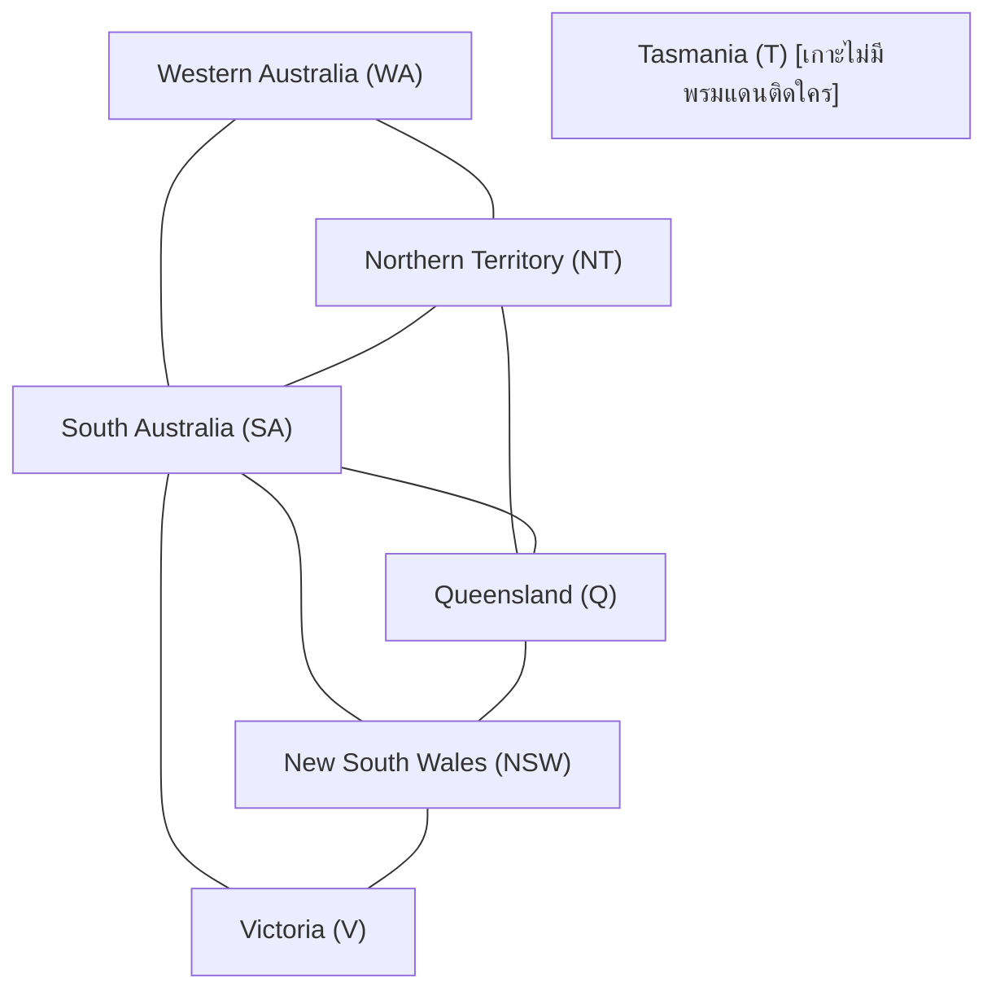

# การระบายสีแผนที่ด้วย Constraint Satisfaction Problem (CSP) - Systematic Search vs Local Search (Min-Conflicts / MCP)

โปรเจกต์นี้เป็นการแก้ปัญหา **การระบายสีแผนที่ (Map Coloring)** ด้วยแนวคิด **Constraint Satisfaction Problem (CSP)** ตามสไลด์การเรียนรู้วิชา AI โดยใช้แผนที่ประเทศออสเตรเลียเป็นโจทย์กรณีศึกษา พร้อมทั้ง **เปรียบเทียบ 2 กระบวนทัศน์หลัก (Search Paradigms)** ในการแก้ปัญหา CSP:
1. **Systematic Search (การค้นหาเชิงโครงสร้าง):** Backtracking Search, MRV Heuristic, Forward Checking
2. **Local Search (การค้นหาเฉพาะที่ / การซ่อมแซม):** Min-Conflicts Algorithm (Min-Conflicts Procedure - MCP)

---

## 1. โจทย์ปัญหาการระบายสีแผนที่ (Problem Formulation)

เป้าหมายคือการหาชุดของสีเพื่อระบายให้กับทุกรัฐในประเทศออสเตรเลีย โดยมีเงื่อนไขสำคัญคือ:
> **"รัฐหรือภูมิภาคที่มีพรมแดนติดกัน จะต้องใช้สีที่ไม่ซ้ำกันเด็ดขาด (Adjacent regions must have different colors)"**


```mermaid
graph TD
    WA["Western Australia (WA)"] --- NT["Northern Territory (NT)"]
    WA --- SA["South Australia (SA)"]
    NT --- SA
    NT --- Q["Queensland (Q)"]
    SA --- Q
    SA --- NSW["New South Wales (NSW)"]
    SA --- V["Victoria (V)"]
    Q --- NSW
    NSW --- V
    T["Tasmania (T) [เกาะไม่มีพรมแดนติดใคร]"]
```

---

## 2. โครงสร้าง CSP ของการระบายสี (CSP Formulation)

ในเชิงโครงสร้าง ปัญหา CSP ประกอบด้วย 3 องค์ประกอบหลัก $(X, D, C)$:

1. **ตัวแปร (Variables - $X$):** รัฐทั้งหมด 7 รัฐที่ต้องการเลือกระบายสี
   $$X = \{\text{WA, NT, SA, Q, NSW, V, T}\}$$
2. **โดเมน (Domains - $D$):** สีที่สามารถเลือกใช้ระบายได้ 3 สี
   $$D = \{\text{Red, Green, Blue}\}$$
3. **ข้อจำกัด (Constraints - $C$):** กฎการระบายสีที่กำหนดว่ารัฐคู่ที่ติดกันต้องมีสีต่างกัน ($X_i \ne X_j$) ทั้ง 9 คู่:
   - $\text{WA} \ne \text{NT}, \quad \text{WA} \ne \text{SA}$
   - $\text{NT} \ne \text{SA}, \quad \text{NT} \ne \text{Q}$
   - $\text{SA} \ne \text{Q}, \quad \text{SA} \ne \text{NSW}, \quad \text{SA} \ne \text{V}$
   - $\text{Q} \ne \text{NSW}$
   - $\text{NSW} \ne \text{V}$
   - $\text{T}$ (Tasmania) เป็นเกาะ ไม่มีพรมแดนติดกับรัฐใด จึงเลือกสีใดก็ได้ในโดเมน

---

## 3. สองกระบวนทัศน์ในการแก้ปัญหา CSP (Search Paradigms)

### ฝั่งที่ 1: Systematic Tree Search (การค้นหาเชิงโครงสร้างแบบแตกกิ่ง)

#### 3.1 Standard Backtracking Search (สไลด์หน้า 12–13)
- ใช้หลักการ Depth-First Search (DFS) เริ่มต้นจากสถานะว่างเปล่า (Empty Assignment)
- ค่อยๆ กำหนดสีให้ตัวแปรทีละตัว พร้อมตรวจสอบความสอดคล้อง (`is_consistent`)
- หากพบทางตัน (ไม่สามารถลงสีใดได้โดยไม่ขัดแย้ง) จะทำการ **"ถอยกลับ" (Backtrack)** ไปยังตัวแปรก่อนหน้า

#### 3.2 Minimum Remaining Values (MRV) Heuristic (สไลด์หน้า 5, 13)
- กลยุทธ์ **"Fail-First"**: เลือกรัฐที่ **เหลือจำนวนสีที่ถูกต้อง (Legal Values) น้อยที่สุดก่อน**
- ช่วยให้ตรวจพบทางตันได้เร็วที่สุด และลดขนาด Search Tree ลงอย่างมาก

#### 3.3 Forward Checking (FC) & การจำลองสไลด์หน้า 14–22
- ทุกครั้งที่ระบายสีให้รัฐใด จะทำการตัดสีนั้นออกจากโดเมนของรัฐเพื่อนบ้านทันที
- หากพบว่ามีรัฐเพื่อนบ้านใดที่ **โดเมนกลายเป็นค่าว่าง (Domain Wipe-Out)** ระบบจะสั่ง Backtrack ทันทีโดยไม่ต้องค้นหาลงไปต่อ

| ลำดับสไลด์ | การระบายสี | ผลกระทบต่อสีที่เหลือของเพื่อนบ้าน | สถานะ |
| :---: | :--- | :--- | :---: |
| **สไลด์ 15** | กำหนด $\text{WA} = \text{Red}$ | ตัด $\text{Red}$ ออกจาก $\text{NT}$ และ $\text{SA}$ เหลือ $\{\text{Green, Blue}\}$ | ผ่าน |
| **สไลด์ 16** | กำหนด $\text{Q} = \text{Green}$ | ตัด $\text{Green}$ ออกจาก $\text{NT}, \text{SA}$ (เหลือแค่ $\{\text{Blue}\}$) และ $\text{NSW}$ (เหลือ $\{\text{Red, Blue}\}$) | ผ่าน |
| **สไลด์ 17** | พยายามกำหนด $\text{V} = \text{Blue}$ | ตัด $\text{Blue}$ ออกจาก $\text{NSW}$ (เหลือ $\{\text{Red}\}$) และตัด $\text{Blue}$ ออกจาก $\text{SA}$ | พบปัญหา |
| **สไลด์ 18–22** | **SA โดเมนว่างเปล่า!** | $\text{SA}$ ติดกับ $\text{WA}(\text{Red}), \text{Q}(\text{Green}), \text{V}(\text{Blue})$ ทำให้ **ไม่มีสีเหลือให้ระบาย** $(\emptyset)$ | **Backtrack ทันที!** |

---

### ฝั่งที่ 2: Local Search / Repair (Min-Conflicts Algorithm - MCP)

**Min-Conflicts Algorithm (MCP)** เป็นอัลกอริทึม Local Search สำหรับ CSP ที่ได้รับความนิยมสูงสุด (AIMA Chapter 6.4):
- **Complete-State Formulation:** เริ่มต้นด้วยการสุ่มระบายสีให้ **ครบทุกรัฐตั้งแต่ต้น** (แม้จะมีสีชนกันอยู่ก็ตาม)
- **Heuristic Function:** กำหนดให้ $h(n) = \text{จำนวนคู่รัฐที่มีข้อขัดแย้ง (Number of Conflicts)}$
- **Iterative Repair:** ในแต่ละรอบ
  1. สุ่มเลือกตัวแปรที่มีข้อขัดแย้ง (Conflicted Variable) ขึ้นมา 1 ตัว
  2. เปลี่ยนสีของตัวแปรนั้นให้เป็นสีที่ **สร้างข้อขัดแย้งกับเพื่อนบ้านน้อยที่สุด (Minimizes Conflicts)**
  3. ทำซ้ำจนกระทั่งข้อขัดแย้งเป็น 0 ($h = 0$) ถือว่าพบคำตอบที่ถูกต้อง

```python
def min_conflicts(csp, max_steps=1000):
    current = {var: random.choice(csp.domains[var]) for var in csp.variables}
    for step in range(max_steps):
        if total_conflicts(current, csp) == 0:
            return current  # สำเร็จ!
        var = random.choice(get_conflicted_variables(current, csp))
        best_value = min(csp.domains[var], key=lambda v: count_conflicts(var, v, current, csp))
        current[var] = best_value
    return None
```

---

## 4. ผลการทดลองและการเปรียบเทียบเชิงตัวเลข (Benchmark Comparison)

ทดสอบรันอัลกอริทึมทั้งหมดบนแผนที่ออสเตรเลีย จำนวน 50 รอบการทดลอง เพื่อวัดความเสถียรและประสิทธิภาพ:

| อัลกอริทึม (Algorithm) | กระบวนทัศน์ (Paradigm) | อัตราความสำเร็จ (Success Rate) | เวลาเฉลี่ย (Avg Runtime) | จำนวนก้าวเฉลี่ย (Avg Steps) | การตรวจเงื่อนไข (Constraint Checks) |
| :--- | :---: | :---: | :---: | :---: | :---: |
| **Standard Backtracking** | Systematic Search | **100.0%** | **~7.0 µs** | 7.0 Assignments | 23.0 |
| **Backtracking + MRV** | Systematic + Heuristic | **100.0%** | ~50.0 µs | 7.0 Assignments | 184.0 |
| **Backtracking + Forward Checking** | Systematic + Pruning | **100.0%** | ~31.4 µs | 7.0 Assignments | 27.0 |
| **Min-Conflicts (MCP)** | Local Search (Repair) | **100.0%** | ~86.2 µs | 7.8 Repairs | 219.2 |

### การวิเคราะห์ผลการทดลอง (Analysis & Discussion):
1. **Systematic Search (Backtracking):**
   - การันตีการพบคำตอบเสมอ (Complete Algorithm) หากมีคำตอบอยู่ใน Search Space
   - Forward Checking ช่วยตัดกิ่งได้เร็วตั้งแต่เนิ่นๆ เมื่อเทียบกับ DFS ดิบในโจทย์ที่ยากขึ้น
2. **Local Search (Min-Conflicts / MCP):**
   - ประสิทธิภาพโดดเด่นมากเมื่อโจทย์มีขนาดใหญ่ระดับล้านตัวแปร (เช่น ปัญหาจัดตาราง $n$-Queens ขนาด $1,000,000$) เพราะใช้หน่วยความจำน้อยมากเพียง $O(n)$ และแก้ปัญหาเฉพาะจุดที่มีความขัดแย้ง
   - บนแผนที่ออสเตรเลีย Min-Conflicts ใช้เวลาเฉลี่ยเพียงไม่กี่ก้าว (เฉลี่ย 7-8 Repairs) ในการกำจัดข้อขัดแย้งทั้งหมดสู่คำตอบที่สมบูรณ์

---

## 5. วิธีการรันโปรแกรม

รันโปรแกรมหลักเพื่อดูผลการรันทั้ง 5 ส่วน (รวมถึงการจำลองสไลด์ 14-22 และตาราง Benchmark):
```bash
python map_coloring_csp.py
```

### ตัวอย่างผลลัพธ์การระบายสี (Valid Solution):
- $\text{WA} = \text{Blue}$
- $\text{NT} = \text{Green}$
- $\text{SA} = \text{Red}$
- $\text{Q} = \text{Blue}$
- $\text{NSW} = \text{Green}$
- $\text{V} = \text{Blue}$
- $\text{T} = \text{Red}$
*(ไม่มีรัฐเพื่อนบ้านคู่ใดมีสีซ้ำกันเด็ดขาด: Conflicts = 0)*
